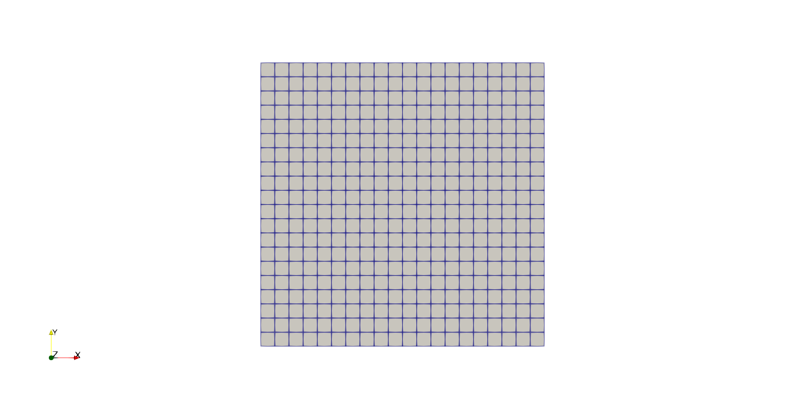

.. _openfoam-handson:

What is OenFOAM ?
=================

- OpenFOAM is an open source Computation Fluid Dynamics (CFD) solve released and developed primarily by OpenCFD Ltd since 2004. 

- It has a large user base across most areas of engineering and science, from both commercial and academic organizations. 

- OpenFOAM has an extensive range of features to solve anything from complex fluid flows involving chemical reactions, turbulence and heat transfer, to acoustics, solid mechanics and electromagnetics. 

- There are two main branches of OpenFOAM, 

  - one is from OpenFOAM Foundation (`www.openfoam.org <http://www.openfoam.org>`_),
  - and the other is OpenCFD Ltd (`www.openfoam.com <http://www.openfoam.com>`_).
  - In this guide, we only consider the later

-  Extensive guides, tutorials, code samples and documentation on the OpenFOAM
   can be found at `www.openfoam.com <http://www.openfoam.com>`_.

General Information
===================

- There are usually three subfolders (**0**, **constant** and **system**) for all OpenFOAM cases

.. code:: bash

 $ ls
 0 constant system

where folder **0** includes the initial and boundary condition variables and the parameters
for turbulence models. **constant** includes geometry information such as meshes (points,
faces, boundary etc.), connections, STL files etc. **system** includes the various dictionaries
(Dict) to set different parameters. For example, we can modify the following files

- **system/blockMeshDict**: to set the block size.
- **system/snappyHexMeshDict**: to set parameters for snappyHexMesh
- **system/decomposeParDict** : to split mesh into submeshes for every MPI-rank

.. code:: bash

 numberOfSubdomains 16; // Set the number of used processes (16)?
 method scotch; // Set the partition method (scotch) ?

- **system/controlDict**: control variables

.. code:: bash

 application simpleFoam; // Set the OpenFOAM solver (simpleFoam)
 ...
 endTime 500; // Set the time steps (500 steps)
 ...
 writeInterval 100; // Write results in files (per 100 steps)
 ...

The general workflow for a OpenFOAM case is shown as follows

.. code:: bash

 Start
   |
   v
 blockMesh // Create a block mesh (set by system/blockMeshDict)
   |
   v
 decomposePar // Divide into submeshes (set by system/decomposeParDict)
   |
   v
 snappyHexMesh // create complex mesh (set by system/snappyHexMeshDict)
   |
   V
 simpleFOAM // run application(OpenFOAM solver) (set by system/controlDict)

Case: Lid-driven cavity flow
============================

This case uses OpenFOAM to calculate the incompressible flow in a two-dimensional square domain, see the Figure blow

 .. image:: img/cavity2D_geometry.png

- As OpenFOAM cases are not backward compatible, always copy cases from *$FOAM_TUTORIALS* of current version

.. code:: bash

 $ module add openfoam/1912  # Using OpenFOAM v1912         
 $ echo $FOAM_BASHRC
 /pdc/vol/openfoam/v1912/OpenFOAM-v1912/etc/bashrc
 $ source $FOAM_BASHRC
 $ cp -r $FOAM_TUTORIALS/incompressible/icoFoam/cavity/cavity . 

- The structure of the case is shown in the following

.. code:: bash

 $ cd cavity
 $ ls
 0 constant system

 $ tree 

 ├── 0 (time directory starting with T=0, initial conditions)
 │   ├── p (pressure)
 │   └── U (flow velocity)
 ├── Allrun (precanned run file)
 ├── constant (hard static stuff i.e. physical properties)
 │   ├── transportProperties (Transport Model e.g. Newtonian)
 └── system
    ├── blockMeshDict 
    ├── controlDict (the main dictionary for controlling the simulation)
    ├── fvSchemes
    ├── fvSolution
    ├── PDRblockMeshDict

- The default setting is to run the application *simpleFoam* in serial with two-dimensional block size of (20×20×1). The case will run up to *0.5* with *0.005* per step, i.e. total 100 time steps. The middle results are stored in every 20 time steps. 

Run the case by default
-----------------------

.. code:: bash

 $ source $FOAM_BASHRC
 $ blockMesh # create the equivalent mesh of (20x20x1)
 $ icoFoam > log.icoFoam
 $ ls
 0  0.1  0.2  0.3  0.4  0.5  constant  system

Until now, you are able to run the OpenFOAM case of cavity flow on PDC cluster. 

Validating the model
--------------------

 To make sure everything is OK we can the output logs from the OpenFOAM run, this will show if the run actually worked or not. there are outputs in the log.simpleFoam file

.. code:: bash

 $ tail -n 50 log.icoFoam
 Time = 0.5

 Courant Number mean: 0.222158 max: 0.852134
 smoothSolver:  Solving for Ux, Initial residual = 2.3091e-07, Final residual = 2.3091e-07, No Iterations 0
 smoothSolver:  Solving for Uy, Initial residual = 5.0684e-07, Final residual = 5.0684e-07, No Iterations 0
 DICPCG:  Solving for p, Initial residual = 8.63844e-07, Final residual = 8.63844e-07, No Iterations 0
 time step continuity errors : sum local = 8.8828e-09, global = 4.94571e-19, cumulative = 1.10417e-17
 DICPCG:  Solving for p, Initial residual = 9.59103e-07, Final residual = 9.59103e-07, No Iterations 0
 time step continuity errors : sum local = 9.66354e-09, global = 1.13175e-18, cumulative = 1.21735e-17
 ExecutionTime = 0.31 s  ClockTime = 1 s

 End

Post-processing
---------------

The post-processing tool supplied with OpenFOAM is *paraFoam*, which is a wrapper of *paraview* (www.paraview.org).  The *paraFoam* post-processing is started by typing in the terminal from within the case directory with loading *paraview* module.
 
.. code:: bash

 $ module add paraview/5.8.1-gcc-7.2
 $ paraFoam

.. image:: img/cavity2D_pressure.png

Creating the finer mesh
-----------------------
We can increase the number of cells in the mesh by using *blockMesh*. In *system/blockMeshDict*, the default mesh size is *(20 20 1)*, 

.. code:: bash

 blocks
 (
    hex (0 1 2 3 4 5 6 7) (20 20 1) simpleGrading (1 1 1)
 );

The mesh size can be refined to ex. *(40 40 1)*,

.. code:: bash

 blocks
 (
    hex (0 1 2 3 4 5 6 7) (20 20 1) simpleGrading (1 1 1)
 ); 

And then rerun the command *blockMesh* and *icoFoam* to generate new results with the refine mesh

.. code:: bash

 $ blockMesh
 $ icoFoam > log.icoFoam.fine

Increasing the Reynolds number
------------------------------
We will now increase the Reynolds number to *100*, at which point the solution takes a noticeably longer time to converge.

.. code:: bash

 $ cp -r cavity cavityHighRe

and then edit *transportProperties* dictionary to reduce the kinematic viscosity to *0.001*

.. code:: bash

 nu              0.01;

to 

.. code:: bash

 nu              0.01;

Increase the *endTime* from *0.5* to *2* so that *icoFoam*  run upto 2 seconds.

.. code:: bash 

 $ icoFoam

High Reynolds number flow
-------------------------

The need to increase spatial and temporal resolution then becomes impractical as the flow moves into the turbulent regime, where problems of solution stability may also occur. 
Instead Reynolds-averaged simulation (RAS) turbulence models are used to solve for the mean 
flow behaviour and calculate the statistics of the fluctuations. The standard k-epsilon model with wall functions will be used in this tutorial to solve the lid-driven cavity case with a Reynolds number of 10^4. Two extra variables are solved for: k, the turbulent kinetic energy, and epsilon, the turbulent dissipation rate. The additional equations and models for turbulent flow are implemented into a OpenFOAM solver called *pisoFoam*.

A range of wall function models is available in OpenFOAM that are applied as boundary conditions on individual patches. This enables different wall function models to be applied to different wall regions. The choice of wall function models are specified through the turbulent viscosity field, nu in the *0/nut* file:

.. code:: bash

 dimensions      [0 2 -1 0 0 0 0];

 internalField   uniform 0;

 boundaryField
 {
    movingWall
    {
        type            nutkWallFunction;
        value           uniform 0;
    }
    fixedWalls
    {
        type            nutkWallFunction;
        value           uniform 0;
    }
    frontAndBack
    {
        type            empty;
    }
 }

The user should now open the field files for *k* and *epsilon* ( in *0/k* and *0/epsilon*) and examine their boundary conditions. 
For a wall boundary condition wall, *epsilon* is assigned an *epsilonWallFunction* boundary condition and a *kqRwallFunction* boundary condition is assigned to *k*. The latter is a generic boundary condition that can be applied to any field that are of a turbulent kinetic energy type, e.g. *k*, *q* or  Reynolds Stress *R* 

Turbulence modelling includes a range of methods, e.g. *RAS* or large-eddy simulation (*LES*), that are provided in OpenFOAM. In most transient solvers, the choice of turbulence modelling method is selectable at run-time through the simulationType keyword in turbulenceProperties dictionary. The user can view this file in the constant directory:

.. code:: bash 

 simulationType  RAS;

 RAS
 {
    RASModel        kEpsilon;

    turbulence      on;

    printCoeffs     on;
 }

The options for *simulationType* are *laminar*, *RAS* and *LES*. 
More informaton on turbulence models can be found in the Extended Code Guide 
With RAS selected in this case, the choice of *RAS* modelling is specified in 
a turbulenceProperties subdictionary, also in the constant directory. 
The turbulence model is selected by the *RASModel* entry from a long list of 
available models that are listed in User Guide Table. The k-Epsilon model 
should be selected which is is the standard k-epsilon 
 the user should also ensure that turbulence calculation is switched on.

Final you can run the case with commands:

.. code:: bash

 $ blockMesh
 $ pisoFoam

