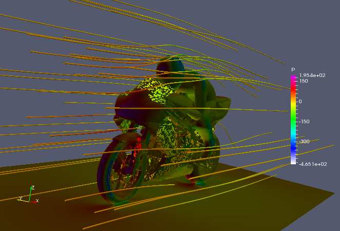

.. _openfoam-handson-motorbike:

MotorBike Case
==============

This case uses OpenFOAM to calculate the steady flow around a motorbike and rider using RAS turbulence modelling with wall functions.
The initialization of flow velocity is to 20 m/s.
The box includes the bike and ride are approximately 2.0x0.8x1.3m and the estimated characteristic length scale L=0.5m, see the Figure below.

.. image:: img/motorbike_overall.png

As you will see, this is a more advanced case than the cavity, involving *snappyHexMesh* to generate the mesh, RANS modelling,
and using several function objects.
The idea is to further strengthen the familiarity with OpenFOAM input and have a more fun case to play around with than the cavity.

Notice that OpenFOAM cases are not backward compatible, please always copy cases from *$FOAM_TUTORIALS* of current version

.. code:: bash

 $ module add openfoam/1912
 $ echo $FOAM_BASHRC
 /pdc/vol/openfoam/v1912/OpenFOAM-v1912/etc/bashrc
 $ source $FOAM_BASHRC
 $ cp -r $FOAM_TUTORIALS/incompressible/simpleFoam/motorBike .

- The structure of the case is shown in the following

.. code:: bash

 $ cd motorBike
 $ ls
 0.orig Allclean Allrun constant system

 $ tree -d 1 .

 ├── 0.orig (time directory starting with T=0, initial conditions)
 │   ├── include
 │   │   ├── fixedInlet
 │   │   ├── frontBackUpperPatches
 │   │   └── initialConditions
 │   ├── k (turbulence kenetic energy)
 │   ├── nut (turbulence viscosity)
 │   ├── omega (turbulence specific dissipation rate)
 │   ├── p (pressure)
 │   └── U (flow velocity)
 ├── Allclean (precanned clean file)
 ├── Allrun (precanned run file)
 ├── constant (hard static stuff i.e. physical properties)
 |-- RASProperties (Reynolds-Averaged Simulation Model to use e.g. kOmegaSST)
 │   ├── polyMesh
 │   │   ├── blockMeshDict
 │   │   ├── boundary
 │   ├── transportProperties (Transport Model e.g. Newtonian)
 │   ├── triSurface
 │   │   ├── motorBike.obj.gz (actual motorbike model)
 │   └── turbulenceProperties
 └── system
    ├── blockMeshDict 
    ├── controlDict (the main dictionary for controlling the simulation)
    ├── decomposeParDict (dictionary for partitioning up the space into smaller chunks)
    ├── fvSchemes
    ├── fvSolution
    ├── snappyHexMeshDict (the dictionary for adding a mesh for simulating surface interactions)

- The default setting is to run the application simpleFoam on 6 MPI-rank with background mesh block
  of size (20×8×8). The results are stored in 5 time steps 100, 200, 300, 400 and 500.

The following tasks are suggested during the hands-on session.

- Try to change some parameters in the snappyHexMeshDict, can you see what happens?

- Try to figure out what each fucntion object does. Search for documentation in the user guide.
  If you are brave, look at the source code, that is the big plus of open-source! 

- Think about what you typically look at in your CFD simulations. See if you can find a suitable function object.
  (Suggestions: inlet-outlet mass flow balance, y+ values, Co-number, velocity min/max, residuals, etc.)

Run the case by default
-----------------------

.. code:: bash

 $ source $FOAM_BASHRC
 $ ./Allrun # run the workflow

The script *Allrun* is a script to collect all commands for whole workflow.
You can use it, but it is not very pedagogical. Better to manually go through each command to remember what it does.

.. code:: bash

 # Copy motorbike surface from resources directory
 cp $FOAM_TUTORIALS/resources/geometry/motorBike.obj.gz constant/triSurface/

 # Restore the 0 directory
 cp -r 0.orig 0
   
 # Extracts and writes surface features to file
 surfaceFeatureExtract

 # Create a block mesh, which will be the background mesh for snappy
 blockMesh

 # Decompose a mesh for parallelization
 decomposePar -copyZero

 # Run the snappyHexMesh in parallel!
 mpirun -np 6 snappyHexMesh -parallel -overwrite > log.snappyHexMesh

 # Run a potential flow solver
 mpirun -np 6 potentialFoam -parallel -writephi > log.potentialFoam

 # Run the steady-state solver for incompressible flow
 mpirun -np 6 simpleFoam -parallel > log.simpleFoam

 # Reconstruct the mesh using geometric information
 reconstructParMesh -constant

 # Reconstruct fields of the parallel case
 reconstructPar -latestTime

Some stuff worth noting here:

- We want to generate the mesh in parallel and this introduces some extra shenanigans into the workflow.
  This is not really needed for this case, but can be good to know.

- We generate the background mesh with *blockMesh* and then decompose that into subdomains with *decomposePar*.
  Here, we have to provide the *-copyZero* flag, so that the *0* folder is simply copied to the *processor* directories
  without change. Otherwise, some stuff will be "optimized away", for example entries for boundaries that are not found in the mesh.
  Since the background mesh generate by *blockMesh* does not contain the motorbike, this would completely ruin the *0* folder.

- We run *potentialFoam* to solve potential flow equations to get a better initial condition. Note a corresponding entry in *system/fvSolution*.
  
- After running the case we need to reconstruct not only the data but also the mesh, which was generated in parallel. For that, we use *reconstructParMesh*.
  The *-constant* flag makes it put the mesh directly into *constant/polyMesh*.
>>>>>>> 43626f76ddfad1862f79bbc9a72c0ba77f587f07

Validating the model
--------------------

To make sure everything is OK we can the output logs from the OpenFOAM run,
this will show if the run actually worked or not. For each stage there is a log.[stage]
output. For example, in the *log.simpleFoam* file the coefficients should be likes

.. code:: bash

 $ tail -n 50 ./log.simpleFoam
 ...
 Time = 500
 ...
 ExecutionTime = 279.99 s ClockTime = 281 s
 ...
 Coefficients
 Cm : 0.157483 (pressure: 0.149969 viscous: 0.00751474)
 Cd : 0.410867 (pressure: 0.393321 viscous: 0.0175461)
 Cl : 0.0751623 (pressure: 0.0758905 viscous: -0.000728213)
 Cl(f) : 0.195065
 Cl(r) : -0.119902
 ensightWrite ensightWrite write: ( U p k omega )
 End
 Finalising parallel run

Here you can see that function objects add new stuff to the log!

Parallelization
---------------
we can change the MPI rank and the decomposition method in file *system/decomposeParDict*, for example, change the default

.. code:: bash

 numberOfSubdomains 6;
 method hierarchical;

to

.. code:: bash

 numberOfSubdomains 24; // MPI-rank
 method scotch;         // using scotch for partition

(Note: If you still used *method hierarchical*, the *hierarchicalCoeffs* in the file
should be coordinately changed)

.. code:: bash

 hierarchicalCoeffs
 {
 n (4 3 2); // 4x3x2 = 24 !!
 } 

The script *Allclean* can be used to delete the log files and remove the results from
motorBike run and then rerun again.

Mesh refinement
---------------

- For scalability tests, the default mesh of 350 k cells may be small, (you can check the mesh information in *log.snappyHexMesh*

.. code:: bash

 Layer mesh : cells:353548  faces:1107696  points:405989

We need to increase the block mesh size and change the settings in file *system/blockMeshDict*, for example, from

.. code:: bash

 blocks
 (
 hex (0 1 2 3 4 5 6 7) (20 8 8) simpleGrading (1 1 1)
 );

to

.. code:: bash

 blocks
 (
 hex (0 1 2 3 4 5 6 7) (40 16 16) simpleGrading (1 1 1)
 );

i.e. the mesh size in x, y, and z-directory increases twice. The script *Allclean* can be used to delete the log files and remove the results from motorBike run and then rerun again.

(Notice: Please do not refine the mesh too much. Otherwise execution time becomes very long)

.. code :: bash

 $ ./Allclean
 $ ./Allrun

The total number of cells is around 1.8 M (check it the log.snappyHexMesh) 

.. code:: bash

 Layer mesh : cells:1892612  faces:5875533  points:2112502

snappyHexMesh
-------------

The mesher performs three steps to create the mesh from the background mesh and the stl surface of the motorbike.

.. code:: bash

 $ less system/snappyHexMeshDict

 // Which of the steps to run
 castellatedMesh true;
 snap            true;
 addLayers       true;

Try running snappyHexMesh without the *-overwrite* flag and take a look at the three produced meshes in the consecutive
time directories written.
Can you see the difference from step to step?
Note that *addLayers* can be removed, and the produced mesh will still conform to the geometry.

There are many settings in can be modified to refine and improve the mesh quality. For example,

.. code:: bash

 $ less system/snappyHexMeshDict
 ...

 // Geometry refinement for wak region 
 geometry
 {
    refinementBox
    {
        type box;
        min  (-1.0 -0.7 0.0);
        max  ( 8.0  0.7 2.5);
    }
 }
 
 ...

   // Region refinement used in Castellated mesh generation.
   refinementRegions
    {
        refinementBox
        {
            mode inside;
            levels ((1E15 4));
        }
    }

  ...

refines the mesh in a predifined box. Try changing the parameters of the box and look at the effect.
You also try creating a new geometric primitve and refining it. As usual, to see what is there set *type* to *banana*,
let the mesher crash and write out available valid options.

Function objects
________________

The motorbike case contains several function objects distributed among respective files in *system*.
Take a look at them, try to understand what they do. Consult the User guide on openfoam.com.

.. code:: bash

 ...
 $ less system/controlDict

 functions
 {
    #include "streamLines"
    #include "wallBoundedStreamLines"
    #include "cuttingPlane"
    #include "forceCoeffs"
    #include "ensightWrite"
 }

 $ ls system
 blockMeshDict     decomposeParDict.6  fvSolution         surfaceFeatureExtractDict
 controlDict       ensightWrite        meshQualityDict    wallBoundedStreamLines
 cuttingPlane      forceCoeffs         snappyHexMeshDict
 decomposeParDict  fvSchemes           streamLines

Inspect the output form each of the objects. Open the streamlines in Paraview.
The Ensight output can also be opened in paraview directly, as well as the cut-plane.
For the forces, check out the .dat file in *postProcessing*.

Now, think of what else would be good to add to the simulation.
For example, writing down the residuals to a file.
Can you find a corresponding function object in the User guide?
Try to add it to the case!

Numerical schemes and solvers
-----------------------------

The numerical schemes are setting in the *system/fvSchemes*.
 
.. code:: bash

 ...
 ddtSchemes  // for time derivatives term

 gradSchemes // for divergence/convection term 

 divSchemes  // for gradient term

 laplacianSchemes // for Laplacian term
  ...

The solvers are selected in the *system/fvSolution*

.. code:: bash

 ...
     p  // GAMG is recommended for pressure
    {
        solver          GAMG;
        smoother        GaussSeidel;
    ...
    U  // for velocities
    {
        solver          smoothSolver;
        smoother        GaussSeidel;
 ...

More details about the OpenFOAM schemes and solvers can be found at `OpenFOAM: User Guide <https://www.openfoam.com/documentation/guides/latest/doc/index.html>`_
Feel free to horse around with the settings even if it kills the solver.
Use the banana trick to see what solvers are available e.g. for pressure and try to change to a different solver?
Is the case running faster or slower? You can always look at the execution time in the log file.

Post-processing
---------------

As already mentioned multiple times, Paraview can be used to inspect the case: mesh, flow variable, function object output.
The motorbike case is great for a fancy visualization, so if you have the time and desire, try to produce something interesting!
It is easiest to work with Paraview on your own machine, but you can also use Tegner.

.. code:: bash

  $ module add paraview
  $ paraFoam

