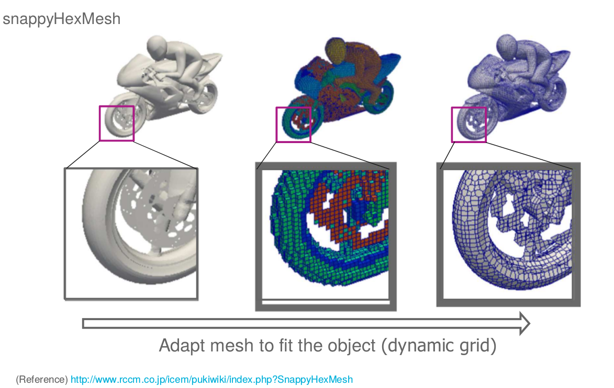
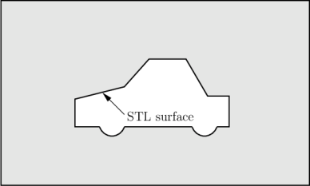
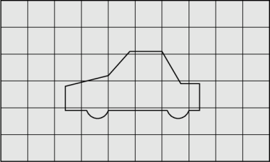
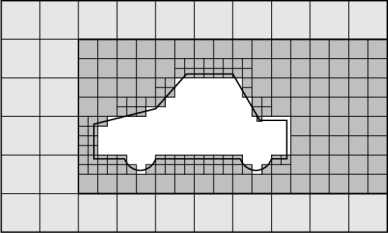
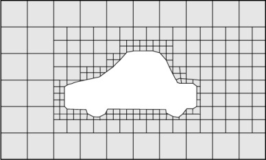
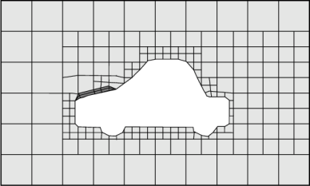

.. _openfoam-handson:

MotorBike Case
==============

This case uses OpenFOAM to calculate the steady flow around a motorbike and ride using RAS turbulence modelling with wall functions. The initialization of flow velocity is 20 m/s. The box includes the bike and ride are approximately 2.0x0.8x1.3m and the estimated characteristic length scale L=0.5m, see the Figure below.

.. image:: img/motorbike_overall.png

- As OpenFOAM cases are not backward compatible, always copy cases from *$FOAM_TUTORIALS* of current version

.. code:: bash

 $ module add openfoam/1912
 $ echo $FOAM_BASHRC
 /pdc/vol/openfoam/v1912/OpenFOAM-v1912/etc/bashrc
 $ source $FOAM_BASHRC
 $ cp -r $FOAM_TUTORIALS/incompressible/simpleFoam/motorBike .

- The structure of the case is shown in the following

.. code:: bash

 $ cd motorBike
 $ ls
 0.orig Allclean Allrun constant system

 $ tree -d 1 .

 ├── 0.orig (time directory starting with T=0, initial conditions)
 │   ├── include
 │   │   ├── fixedInlet
 │   │   ├── frontBackUpperPatches
 │   │   └── initialConditions
 │   ├── k (turbulence kenetic energy)
 │   ├── nut (turbulence viscosity)
 │   ├── omega (turbulence specific dissipation rate)
 │   ├── p (pressure)
 │   └── U (flow velocity)
 ├── Allclean (precanned clean file)
 ├── Allrun (precanned run file)
 ├── constant (hard static stuff i.e. physical properties)
 |-- RASProperties (Reynolds-Averaged Simulation Model to use e.g. kOmegaSST)
 │   ├── polyMesh
 │   │   ├── blockMeshDict
 │   │   ├── boundary
 │   ├── transportProperties (Transport Model e.g. Newtonian)
 │   ├── triSurface
 │   │   ├── motorBike.obj.gz (actual motorbike model)
 │   └── turbulenceProperties
 └── system
    ├── blockMeshDict 
    ├── controlDict (the main dictionary for controlling the simulation)
    ├── decomposeParDict (dictionary for partitioning up the space into smaller chunks)
    ├── fvSchemes
    ├── fvSolution
    ├── snappyHexMeshDict (the dictionary for adding a mesh for simulating surface interactions)

- The default setting is to run the application simpleFoam on 6 MPI-rank with block
size of (20×8×8). The results are stored in 5 time steps 100, 200, 300, 400 and 500.
The workflow is following

.. image:: img/motorbike_blockmesh.png

Run the case by default
-----------------------

.. code:: bash

 $ source $FOAM_BASHRC
 $ ./Allrun # run the workflow

The result is shown in the following figure

.. image:: img/motorbike_result.png

Validating the model
--------------------

To make sure everything is OK we can the output logs from the OpenFOAM run,
this will show if the run actually worked or not. For each stage there is a log.[stage]
output. For example, in the *log.simpleFoam* file the coefficients should be likes

.. code:: bash

 $ tail -n 50 ./log.simpleFoam
 ...
 Time = 500
 ...
 ExecutionTime = 279.99 s ClockTime = 281 s
 ...
 Coefficients
 Cm : 0.157483 (pressure: 0.149969 viscous: 0.00751474)
 Cd : 0.410867 (pressure: 0.393321 viscous: 0.0175461)
 Cl : 0.0751623 (pressure: 0.0758905 viscous: -0.000728213)
 Cl(f) : 0.195065
 Cl(r) : -0.119902
 ensightWrite ensightWrite write: ( U p k omega )
 End
 Finalising parallel run

Parallelization
---------------
we can change the MPI rank and the decomposition method in file *system/decomposeParDict*, for example, change the default

.. code:: bash

 numberOfSubdomains 6;
 method hierarchical;

to

.. code:: bash

 numberOfSubdomains 24; #// MPI-rank
 method hierarchical;

(Note: If you still used “method hierarchical”, the hierarchicalCoeffs in the file
should be coordinately changed)

.. code:: bash

 hierarchicalCoeffs
 {
 n (4 3 2); // 4x3x2 = 24 !!
 } 

The script *Allclean* can be used to delete the log files and remove the results from
motorBike run and then rerun again.

Mesh refinement
---------------

- For scalability tests, the default mesh of 350 k cells may be small, (you can check the mesh information in *log.snappyHexMesh*

.. code:: bash

 Layer mesh : cells:353548  faces:1107696  points:405989

We need to increase the block mesh size and change the settings in file *system/blockMeshDict*, for example, from

.. code:: bash

 blocks
 (
 hex (0 1 2 3 4 5 6 7) (20 8 8) simpleGrading (1 1 1)
 );

to

.. code:: bash

 blocks
 (
 hex (0 1 2 3 4 5 6 7) (40 16 16) simpleGrading (1 1 1)
 );

i.e. the mesh size in x, y, and z-directory increases twice. The script *Allclean* can be used to delete the log files and remove the results from motorBike run and then rerun again.

.. code:: bash

 Layer mesh : cells:1892612  faces:5875533  points:2112502

snappyHexMesh
-------------

- Includes three (optional) steps from a triangle surfacce obtained from e.g. CAD models.

.. code:: bash

 // Which of the steps to run
 castellatedMesh true;
 snap            true;
 addLayers       true;

- *castellatedMesh* : refines around surface and features and then splits cell by region

- *snap* : snaps cells to surface

- *addLayers* add layers (e.g. boundary layers) if necessary 

Function objects
__________________

Numerical schemes and solvers
-----------------------------

