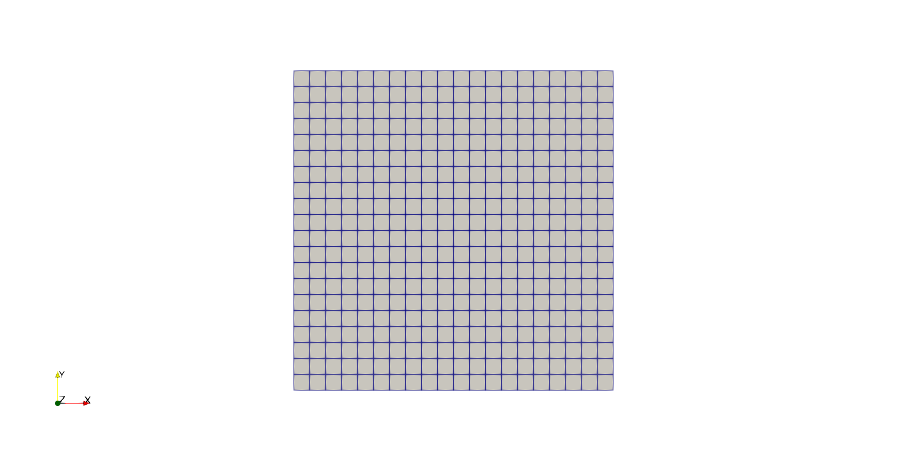

.. _handson:

Case Study
==========

.. questions::

   - How do I set up a case with an OpenFOAM-native mesher?
   - How do I set up boundary conditions and turbulence modelling?
   - How do I run the case in parallel?
   - How do I postprocess the results?

.. objectives::

   - Learn how to create a block-structured mesh with ``blockMesh``;
   - Set up boundary conditions and turbulence modelling, if any;
   - Run the case either in serial or parallel;
   - Learn how to visualise and postprocess results in Paraview.

.. instructor-note::

   - 15 min teaching
   - 0 min exercises

Lid-driven cavity flow
----------------------------

This case uses OpenFOAM to calculate the incompressible flow in a two-dimensional square domain, see the Figure below:

 .. image:: img/cavity2D_geometry.png

You can copy it from the OpenFOAM tutorial folder:

.. code:: console

   $ cp -r $FOAM_TUTORIALS/incompressibleFluid/cavity /path/where/you/want/to/run

The structure of the case is the following:

.. code:: console

 $ cd cavity
 $ ls
 0 constant system

 $ tree 
  .
  ├── 0
  │   ├── epsilon
  │   ├── k
  │   ├── nut
  │   ├── nuTilda
  │   ├── omega
  │   ├── p
  │   └── U
  ├── constant
  │   ├── momentumTransport
  │   └── physicalProperties
  ├── r.foam
  └── system
      ├── blockMeshDict
      ├── controlDict
      ├── fvSchemes
      └── fvSolution

The default setting is to run the solver in serial on a two-dimensional square
mesh of size (20×20×1). Note that all OpenFOAM cases are three-dimensional. For
a two-dimensional case the third dimension has a single computational cell, and
special boundary conditions are employed. The case will run up to time *0.5*
with *0.005* non-dimensional time units per step, i.e. a total of 100 time
steps. The simulation results are stored every 20 time steps. 

- Use the case as a sandbox to change various settings and play with the 
  parameters. Use the "banana-trick" to learn about possible options: 
  change any dictionary keyword to "banana", the case will crash showing possible
  valid options for the keyword.

Run the case by default
+++++++++++++++++++++++

.. code:: bash

 $ blockMesh # create the equivalent mesh of (20x20x1)
 $ foamRun | tee log
 $ ls
 0  0.1  0.2  0.3  0.4  0.5  constant  system

Congratulations, you were able to run your first OpenFOAM case! 

Inspecting the log file
+++++++++++++++++++++++

To make sure everything is OK we can look at the output logs from the OpenFOAM run.
This will show us if the run actually worked as intended.
To do this, inspect *log.icoFoam* with your favorite editor or simply use commands 
like ``tail``.

.. code:: console

 $ tail -n 50 log.icoFoam
 Time = 0.5

 Courant Number mean: 0.222158 max: 0.852134
 smoothSolver:  Solving for Ux, Initial residual = 2.3091e-07, Final residual = 2.3091e-07, No Iterations 0
 smoothSolver:  Solving for Uy, Initial residual = 5.0684e-07, Final residual = 5.0684e-07, No Iterations 0
 DICPCG:  Solving for p, Initial residual = 8.63844e-07, Final residual = 8.63844e-07, No Iterations 0
 time step continuity errors : sum local = 8.8828e-09, global = 4.94571e-19, cumulative = 1.10417e-17
 DICPCG:  Solving for p, Initial residual = 9.59103e-07, Final residual = 9.59103e-07, No Iterations 0
 time step continuity errors : sum local = 9.66354e-09, global = 1.13175e-18, cumulative = 1.21735e-17
 ExecutionTime = 0.31 s  ClockTime = 1 s

 End

There is quite a bit of information to be extracted from the logs, such as residuals of the iterative 
solvers and the Courant number.
Depending on the simulation options, the logs may become more expressive, monitoring additional 
simulation aspects.

Creating the finer mesh
+++++++++++++++++++++++

The cavity case is too tiny to make running in parallel a reasonable alternative.
We will therefore make the mesh denser.
For now, we just provide the instruction for refining without much explaination.
In ``system/blockMeshDict``, the default mesh size is set by the triple *(20 20 1)*, 
in the following lines.

.. code:: bash

 blocks
 (
    hex (0 1 2 3 4 5 6 7) (20 20 1) simpleGrading (1 1 1)
 );

So, to refine we can change it to e.g. *(100 100 1)*,

.. code:: bash

 blocks
 (
    hex (0 1 2 3 4 5 6 7) (100 100 1) simpleGrading (1 1 1)
 ); 

And then rerun the command *blockMesh*.

.. code:: console

 $ blockMesh

If you now run ``foamRun`` you will notice that the solver is slow and that 
the Courant number is very high!

.. code:: text

 Time = 0.01

 Courant Number mean: 0.514905 max: 4.28024
 smoothSolver:  Solving for Ux, Initial residual = 0.124381, Final residual = 9.84033e-06, No Iterations 374
 smoothSolver:  Solving for Uy, Initial residual = 0.546347, Final residual = 9.89857e-06, No Iterations 402
 DICPCG:  Solving for p, Initial residual = 0.937878, Final residual = 0.0449945, No Iterations 58
 time step continuity errors : sum local = 0.00115914, global = -3.719e-19, cumulative = -1.47005e-18
 DICPCG:  Solving for p, Initial residual = 0.887143, Final residual = 9.90418e-07, No Iterations 171
 time step continuity errors : sum local = 2.39948e-08, global = -4.25067e-19, cumulative = -1.89512e-18
 ExecutionTime = 0.54 s  ClockTime = 0 s

This makes sense: we decreased the cell size, so to keep the Courant 
number reasonable we also need to change the time step.
This is done by changing the value of the *deltaT* keyword in the *controlDict*.
We can set the time-step to 0.0005.

.. code:: bash

 deltaT 0.0005;

Running in parallel
+++++++++++++++++++

Let us now run the case in parallel.
Inspecting *system/decomposeParDict*, we see that the case is set to be decomposed into 4 subdomains.

.. code:: cpp

 numberOfSubdomains  4;

We will leave this as is and now we can decompose the case and run in parallel.

.. code:: console

 $ decomposePar -fileHandler collated

This will create a ``processors4`` directory which contains, for each writed step and field,
a single file that can be accessed by all ranks in parallel. The default ``uncollated`` 
format would create one file per field and rank, which can quickly amount to millions 
of files for massively parallel simulations.
To run the case, execute the following command.

.. code:: console

 $ mpirun -np 4 foamRun -parallel -fileHandler collated | tee logParallel

Upon completion we can reconstruct the solution over the whole domain:

.. code:: console
  
 $ reconstructPar -latestTime -fileHandler collated

Here, the *-latestTime* flag tells the program to only reconstruct the last time-step.

To do yourself:

- Now that we decreased the time step there is a lot of output saved, look at e.g. *processor0*.
  Change the *writeInterval* in the *controlDict* to reduce that.

- Play around with mesh sizes and change *decomposeParDict* to run on a larger number of processors.

Increasing the Reynolds number
++++++++++++++++++++++++++++++

We will now increase the Reynolds number to *100*, at which point the solution takes a noticeably 
longer time to converge.

.. code:: console

 $ cp -r cavity cavityHighRe

and then edit *physicalProperties* dictionary to reduce the kinematic viscosity to *0.001*

.. code:: console

 nu              0.01;

to 

.. code:: console

 nu              0.001;

Increase the *endTime* from *0.5* to *2* so that ``foamRun`` runs up to 2 seconds.

.. code:: console 

 $ foamRun

Turbulence modelling (optional)
+++++++++++++++++++++++++++++++

The need to increase spatial and temporal resolution becomes impractical
as the flow moves into the turbulent regime, where problems of solution
stability may also occur. Instead, Reynolds-averaged simulation (RAS) turbulence
models are used to solve for the mean flow behaviour and calculate the
statistics of the fluctuations. The standard k-epsilon model with wall
functions will be used in this tutorial to solve the lid-driven cavity case
with a Reynolds number of :math:`10^4`. Two extra variables are solved for: k, the
turbulent kinetic energy, and :math:`\varepsilon`, the turbulent dissipation rate. 
To setup the model you will need three additional files in the 0 directory: *nut*, 
*k*, *epsilon*. Create them by making a copy of the *p* file, and then modify them 
as needed.

A range of wall function models is available in OpenFOAM that are applied as
boundary conditions on individual patches. This enables different wall function
models to be applied to different wall regions. The choice of wall function
models are specified through the turbulent viscosity field, nut, in the *0/nut*
file:

.. code:: cpp

 dimensions      [0 2 -1 0 0 0 0];

 internalField   uniform 0;

 boundaryField
 {
    movingWall
    {
        type            nutkWallFunction;
        value           uniform 0;
    }
    fixedWalls
    {
        type            nutkWallFunction;
        value           uniform 0;
    }
    frontAndBack
    {
        type            empty;
    }
 }

You should should now open the field files for *k* and *epsilon* ( in *0/k* and *0/epsilon*) 
and set their boundary conditions. For a wall boundary condition wall, *epsilon* is assigned 
an *epsilonWallFunction* boundary condition and a *kqRwallFunction* boundary condition is assigned to *k*.
The latter is a generic boundary condition that can be applied to any field that are of a turbulent kinetic 
energy type, e.g. *k*, *q* or  Reynolds Stress *R*. 

Turbulence modelling includes a range of methods, e.g. *RAS* or large-eddy simulation (*LES*), that are 
provided in OpenFOAM. In most transient solvers, the choice of turbulence modelling method is selectable 
at run-time through the simulationType keyword in momentumTransport dictionary. The user can view this 
file in the constant directory:

.. code:: cpp 

 simulationType  RAS;

 RAS
 {
    RASModel        kEpsilon;

    turbulence      on;

    printCoeffs     on;
 }

The options for *simulationType* are *laminar*, *RAS* and *LES*. 
More informaton on turbulence models can be found in the Extended Code Guide.
With RAS selected in this case, the choice of *RAS* modelling is specified in 
a turbulenceProperties subdictionary, also in the constant directory. 
The turbulence model is selected by the *RASModel* entry from a long list of 
available models that are listed in User Guide Table. The k-Epsilon model 
should be selected which is is the standard k-epsilon 
the user should also ensure that turbulence calculation is switched on.

Finally, you can run the case with commands:

.. code:: console

 $ blockMesh
 $ foamRun

Post-processing (optional)
++++++++++++++++++++++++++

The post-processing tool supplied with OpenFOAM is *paraFoam*, which is a
wrapper of `Paraview <https://www.paraview.org>`__. The *paraFoam* tool is
started by typing in the terminal from within the case directory.

.. code:: bash

 $ module add paraview/5.8.1-gcc-7.2
 $ paraFoam
 
Alternatively, if you can add an empty file inside the case directory. 

.. code:: console

 $ touch case.foam

You can now open this file with regular Paraview, and not *paraFoam*.

.. image:: img/cavity2D_pressure.png

MotorBike
---------

This case uses OpenFOAM to calculate the steady flow around a motorbike and
rider using RAS turbulence modelling with wall functions. The initialization of
the velocity field is to 20 m/s. The box includes both bike and rider and 
its size is approximately 2.0x0.8x1.3m. The estimated characteristic length scale
is L=0.5m.

.. image:: img/motorbike_overall.png

This is a more advanced case than the cavity, involving *snappyHexMesh* to generate 
the mesh, RANS modelling, and using several function objects.

Notice that OpenFOAM cases are not backwards-compatible, so a tutorial from the 
current OpenFOAM version is needed.

.. code:: console

 $ cp -r $FOAM_TUTORIALS/incompressible/simpleFoam/motorBike .

- The structure of the case is as follows:

.. code:: console

 $ cd motorBike
 $ ls
 0.orig Allclean Allrun constant system

 $ tree -d 1 .

  .
  ├── 0
  │   ├── include
  │   │   ├── fixedInlet
  │   │   ├── frontBackUpperPatches
  │   │   └── initialConditions
  │   ├── k
  │   ├── nut
  │   ├── nuTilda
  │   ├── p
  │   └── U
  ├── Allclean
  ├── Allrun
  ├── constant
  │   ├── geometry
  │   │   └── README
  │   ├── momentumTransport
  │   └── physicalProperties
  └── system
      ├── blockMeshDict
      ├── controlDict
      ├── cutPlane
      ├── decomposeParDict
      ├── forceCoeffs
      ├── functions
      ├── fvSchemes
      ├── fvSolution
      ├── snappyHexMeshDict
      └── streamlines

The default setting is to run the application simpleFoam on 6 MPI-rank with
background mesh block of size (20×8×8). The results are stored in 5 time steps
100, 200, 300, 400 and 500.

Run the case with default parameters
++++++++++++++++++++++++++++++++++++

.. code:: console

 $ ./Allrun # run the workflow

The script *Allrun* is a script to collect all the commands for whole workflow.
You can use it, but it is not very pedagogical. Better to manually go through
each command to remember what it does.

.. code:: console

 # Copy motorbike surface from resources directory
 cp $FOAM_TUTORIALS/resources/geometry/motorBike.obj.gz constant/geometry/

 # Create a block mesh, which will be the background mesh for snappy
 blockMesh

 # Decompose a mesh for parallelization
 decomposePar -copyZero -fileHandler collated

 # Run the snappyHexMesh in parallel!
 mpirun -np 6 snappyHexMesh -parallel -fileHandler collated -overwrite | tee log.snappyHexMesh

 # Run a potential flow solver to get a good initial condition
 mpirun -np 6 potentialFoam -parallel -fileHandler collated -initialiseUBCs | tee log.potentialFoam

 # Run the steady-state solver for incompressible flow
 mpirun -np 6 foamRun -parallel -fileHandler collated | tee log.foamRun

 # Reconstruct the mesh using geometric information
 reconstructParMesh -constant -fileHandler collated

 # Reconstruct fields of the parallel case
 reconstructPar -fileHandler collated -latestTime

Some stuff worth noting here:

- Mesh generation is performed in parallel;

- We generate the background mesh with *blockMesh* and then decompose that into
  subdomains with ``decomposePar``. Here, we have to provide the ``-copyZero``
  flag, so that the *0* folder is simply copied to the *processor* directories
  without change. Otherwise, some stuff will be "optimized away", for example
  entries for boundaries that are not found in the mesh. Since the background
  mesh generate by ``blockMesh`` does not contain the motorbike, this would
  completely ruin the *0* folder.

- We run ``potentialFoam`` to solve potential flow equations to get a better
  initial condition. Note a corresponding entry in ``system/fvSolution``.
  
- After running the case we need to reconstruct not only the data but also the
  mesh, which was generated in parallel. For that, we use
  ``reconstructParMesh``. The ``-constant`` flag makes it put the mesh directly
  into ``constant/polyMesh``.

Validating the model
++++++++++++++++++++

To make sure everything is OK we can the output logs from the OpenFOAM run,
this will show if the run actually worked or not. For each stage there is a
log.[stage] output. For example, in the *log.foamRun* file the coefficients
should be likes

.. code:: console

 $ tail -n 50 ./log.simpleFoam
 ...
 Time = 500
 ...
 ExecutionTime = 279.99 s ClockTime = 281 s
 ...
 Coefficients
 Cm : 0.157483 (pressure: 0.149969 viscous: 0.00751474)
 Cd : 0.410867 (pressure: 0.393321 viscous: 0.0175461)
 Cl : 0.0751623 (pressure: 0.0758905 viscous: -0.000728213)
 Cl(f) : 0.195065
 Cl(r) : -0.119902
 ensightWrite ensightWrite write: ( U p k omega )
 End
 Finalising parallel run

Here you can see that function objects add new stuff to the log!

Parallelization
+++++++++++++++

We can change the number of MPI ranks and the decomposition method in file
*system/decomposeParDict*, for example, change the default.

.. code:: cpp

 numberOfSubdomains 6;
 method hierarchical;

to

.. code:: cpp

 numberOfSubdomains 24; // MPI-rank
 method scotch;         // using scotch for partition

(Note: If you still used *method hierarchical*, the *hierarchicalCoeffs* in the
file should be coordinately changed)

.. code:: cpp

 hierarchicalCoeffs
 {
 n (4 3 2); // 4x3x2 = 24 !!
 } 

The script ``Allclean`` can be used to delete the log files and remove the results from
motorBike run and then rerun again.

Mesh refinement
+++++++++++++++

Information about cell count and other quality parameters can be inspected with
the ``checkMesh`` command.

.. code:: text

  Mesh stats
      points:           3889958
      faces:            10253758
      internal faces:   9645402
      cells:            3215663
      faces per cell:   6.1882
      boundary patches: 76
      point zones:      0
      face zones:       0
      cell zones:       0

We need to increase the block mesh size and change the settings in file *system/blockMeshDict*, for example, from

.. code:: bash

 blocks
 (
 hex (0 1 2 3 4 5 6 7) (20 8 8) simpleGrading (1 1 1)
 );

to

.. code:: cpp

 blocks
 (
 hex (0 1 2 3 4 5 6 7) (40 16 16) simpleGrading (1 1 1)
 );

i.e. the mesh size in x, y, and z-directory increases twice. The script
*Allclean* can be used to delete the log files and remove the results from
motorBike run and then rerun again.

.. code :: console

 $ ./Allclean
 $ ./Allrun

snappyHexMesh
+++++++++++++

The mesher performs three steps to create the mesh from the background mesh and the stl surface of the motorbike.

.. code:: bash

 $ less system/snappyHexMeshDict

 // Which of the steps to run
 castellatedMesh true;
 snap            true;
 addLayers       true;

Try running snappyHexMesh without the *-overwrite* flag and take a look at the three produced meshes in the consecutive
time directories written.
Can you see the difference from step to step?
Note that *addLayers* can be removed, and the produced mesh will still conform to the geometry.

There are many settings which can be modified to refine and improve the mesh quality. For example,

.. code:: bash

 $ less system/snappyHexMeshDict
 ...

 // Geometry refinement for wak region 
 geometry
 {
    refinementBox
    {
        type box;
        min  (-1.0 -0.7 0.0);
        max  ( 8.0  0.7 2.5);
    }
 }
 
 ...

   // Region refinement used in Castellated mesh generation.
   refinementRegions
    {
        refinementBox
        {
            mode inside;
            levels ((1E15 4));
        }
    }

  ...

refines the mesh in a predifined box. Try changing the parameters of the box and look at the effect.
You could also try creating a new geometric primitve and refining it. As usual, to see what is there set *type* to *banana*,
let the mesher crash and write out available valid options.

Function objects
++++++++++++++++

The motorbike case contains several function objects distributed among respective files in *system*.
Take a look at them, try to understand what they do. Consult the User guide on openfoam.com.

.. code:: bash

 ...
 $ less system/controlDict

 functions
 {
    #include "streamLines"
    #include "wallBoundedStreamLines"
    #include "cuttingPlane"
    #include "forceCoeffs"
    #include "ensightWrite"
 }

 $ ls system
 blockMeshDict     decomposeParDict.6  fvSolution         surfaceFeatureExtractDict
 controlDict       ensightWrite        meshQualityDict    wallBoundedStreamLines
 cuttingPlane      forceCoeffs         snappyHexMeshDict
 decomposeParDict  fvSchemes           streamLines

Inspect the output form each of the objects. Open the streamlines in Paraview.
The Ensight output can also be opened in paraview directly, as well as the cut-plane.
For the forces, check out the .dat file in *postProcessing*.

Now, think of what else would be good to add to the simulation.
For example, writing down the residuals to a file.
Can you find a corresponding function object in the User guide?
Try to add it to the case!

Numerical schemes and solvers
+++++++++++++++++++++++++++++

The numerical schemes are setting in the *system/fvSchemes*.
 
.. code:: bash

 ...
 ddtSchemes  // for time derivatives term

 gradSchemes // for divergence/convection term 

 divSchemes  // for gradient term

 laplacianSchemes // for Laplacian term
  ...

The solvers are selected in the *system/fvSolution*

.. code:: bash

 ...
     p  // GAMG is recommended for pressure
    {
        solver          GAMG;
        smoother        GaussSeidel;
    ...
    U  // for velocities
    {
        solver          smoothSolver;
        smoother        GaussSeidel;
 ...

More details about the OpenFOAM schemes and solvers can be found at `OpenFOAM: User Guide <https://www.openfoam.com/documentation/guides/latest/doc/index.html>`_
Feel free to horse around with the settings even if it kills the solver.
Use the banana trick to see what solvers are available e.g. for pressure and try to change to a different solver?
Is the case running faster or slower? You can always look at the execution time in the log file.

Post-processing
+++++++++++++++

As already mentioned multiple times, Paraview can be used to inspect the case: mesh, flow variable, function object output.
The motorbike case is great for a fancy visualization, so if you have the time and desire, try to produce something interesting!
It is easiest to work with Paraview on your own machine, but you can also use Tegner.

.. code:: bash

  $ module add paraview
  $ paraFoam

.. image:: img/motorbike_result.png

